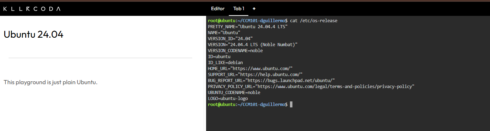
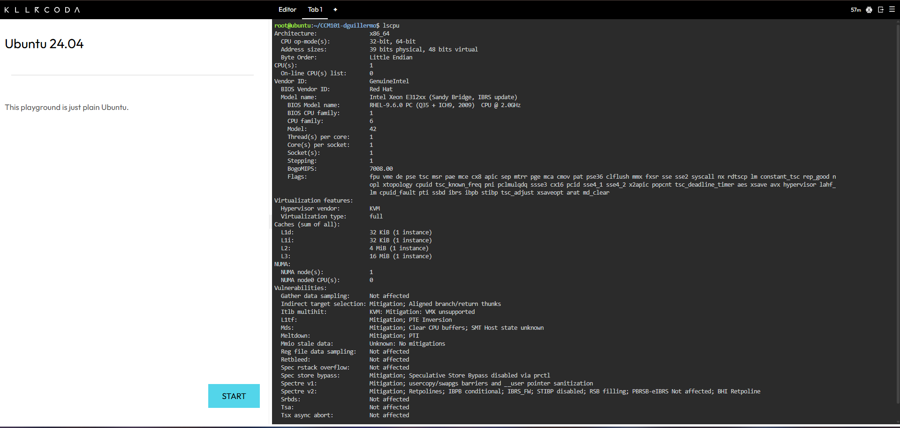
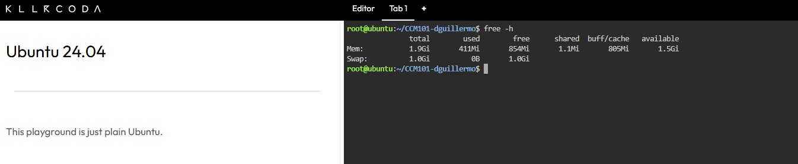
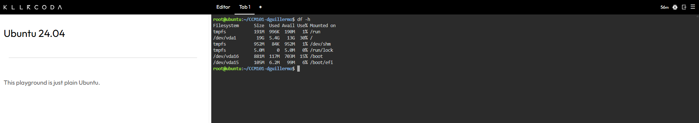

# ☁️ Mission 3 – Become a Multi-Cloud Explorer
> **Course:** CCM101 – Cloud Computing Laboratory Activities  
> **Organization:** CloudNova Technologies | Evaluation Team  

---

## 🌎 Overview

Welcome to **Mission 3: Become a Multi-Cloud Explorer**. Following a successful Cloud Infrastructure Assessment, this project documents our evaluation of the world's leading public cloud providers—**Amazon Web Services (AWS)**, **Microsoft Azure**, and **Google Cloud Platform (GCP)**. 

As part of the Cloud Evaluation Team at CloudNova Technologies, this repository serves as technical documentation comparing cloud capabilities, mapping equivalent services, delivering tailored client architecture recommendations, and continuing our system-level Linux environment investigations.

---

## 🎯 Objectives

* ☁️ **Explore Public Cloud Platforms:** Analyze the architecture and core capabilities of AWS, Azure, and GCP.
* 🔍 **Service Mapping:** Identify and categorize equivalent core services across all three major providers.
* 📊 **Comparative Analysis:** Evaluate platforms based on strengths, cost models, and ideal target workloads.
* 💼 **Architectural Guidance:** Deliver strategic cloud recommendations for realistic enterprise and startup client scenarios.
* 📝 **Technical Documentation:** Author clean, standardized Markdown documentation for repository inclusion.
* 🐧 **System Investigation:** Conduct terminal-level diagnostic checks on Linux server infrastructure.

---

Operating System


CPU information


Memory


Disk space



## 📁 Repository Structure

```text
.
├── README.md                          # Main project overview and Linux investigation
├── cloud-platform-comparison.md       # Major cloud comparison & equivalent service mapping
└── client-recommendations.md          # Client scenarios & multi-cloud decision matrix

